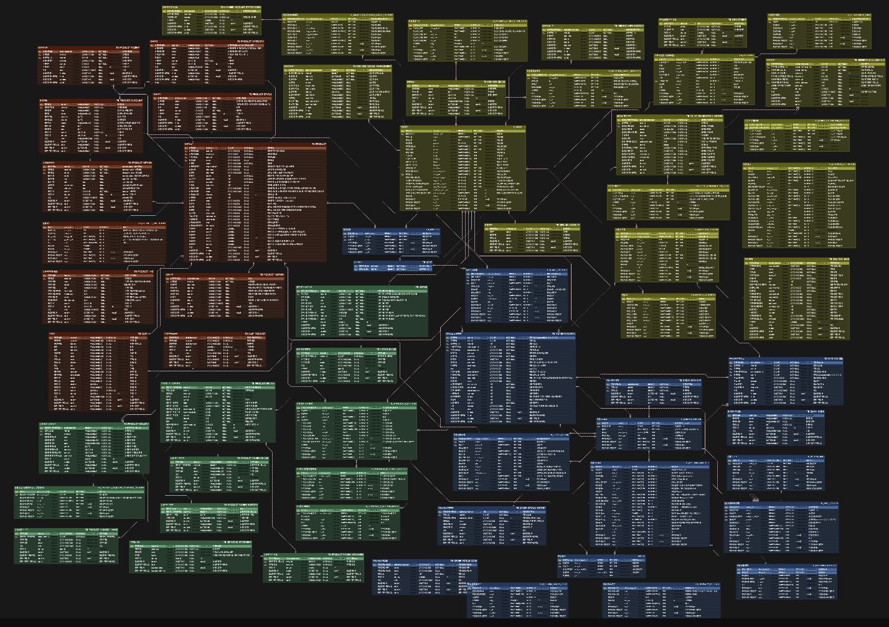

# ezmeal 쇼핑몰 프로젝트

[//]: # (## 프로젝트 이미지 삽입&#40;너비 300정도, 가운데 정렬&#41; H2)
</img>

## 목차
1. [프로젝트 소개](#프로젝트-소개진행한-프로젝트에-대해-간단하게-5-10줄정도)
2. [개발 환경 및 기술스택(배지)](#개발환경-및-기술-스택-배지-활용)
3. [맡은 역할](#맡은-역할)
4. [화면 구성 / API 주소](#화면-구성--api-주소)
5. [주요기능 소개](#주요기능)

## 프로젝트 소개
- 식품 쇼핑몰 프로젝트
- 프로젝트 기간 : 2023년 5월 30일 ~ 2023년 8월 6일 (총 69일)
- 팀원 구성 : 백엔드 3명 프론트엔드 1명
- 핵심 모듈 : **상품(ERD담당)** / **회원(개발담당)** / 주문 / 게시판
- ERD 
  - TABLES - 61
  - COLUMNS - 830

### 개발환경 및 기술 스택 (배지 활용)
- Backend
  - Java(11)
  - Spring(5.2.21)
  - MySQL
  - MyBatis
- Frontend
  - HTML5 / CSS3 
  - JavaScript(ES6)
  - JSP
- Server
  - Apache Tomcat 9.0.74

- Tools
    - IntelliJ, DataGrip, ERD Cloud, Git, Github, Notion

### 맡은 역할
- **백현욱(팀원)**
  - 담당 ERD : 상품관련 ERD 설계
  - 담당 페이지(백엔드, 프론트엔드)
    - 회원관련 회원가입/수정/탈퇴, 로그인, ID/PW찾기, 적립금
    - 관리자 - 로그인, 회원정보조회
    - 프론트 - 마이페이지 헤더/사이드, 관리자페이지 로그인 헤더 
  - 프로젝트 협업관련 내용 - 컨벤션, WBS등 산출물 정리 및 관리 

    
[//]: # (참고사이트 :   )
[//]: # (https://cocoon1787.tistory.com/689)

## 화면 구성 / API 주소

### ERD - 담당 : 상품(빨간색)
</img>

### 화면 구성 캡쳐 
#### 로그인화면
#### 회원가입화면
#### 회원정보수정
#### 회원탈퇴화면
#### 마이페이지 헤더,사이드바
#### 적립금
#### 관리자 로그인
#### 관리자 회원정보조회 

## 주요기능

프로젝트의 주요기능들을 소개한다

## reference 추가 예정 
